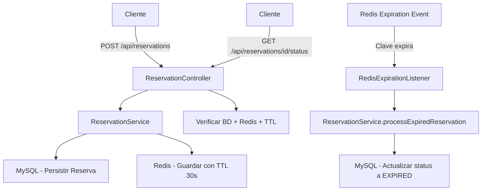

# PoC Redis Spring Boot - Sistema de Reservas con Expiración Automática

## 📋 Descripción

Esta es una **Proof of Concept (PoC)** que demuestra la integración de **Redis** con **Spring Boot** para implementar un sistema de reservas con expiración automática. El proyecto utiliza Redis como caché temporal y MySQL como base de datos persistente, implementando un patrón de eventos para manejar la expiración automática de reservas.

## 🏗️ Arquitectura

### Componentes Principales

- **Spring Boot 3.5.5** - Framework principal
- **Redis 8.2** - Caché temporal con expiración automática
- **MySQL (Percona Server 8.0)** - Base de datos persistente
- **Spring Data Redis** - Integración con Redis
- **Spring Data JPA** - Persistencia con MySQL

### Flujo de Datos



## 🚀 Características

- ✅ **Reservas temporales**: Las reservas expiran automáticamente después de 30 segundos
- ✅ **Eventos Redis**: Escucha eventos de expiración de claves en tiempo real
- ✅ **Doble persistencia**: Datos en MySQL (persistente) y Redis (temporal)
- ✅ **API REST**: Endpoints para crear y consultar reservas
- ✅ **Monitoreo**: Endpoint para verificar estado de reservas (BD + Redis + TTL)
- ✅ **Docker Compose**: Infraestructura completa con un comando

## 🛠️ Tecnologías

- **Java 24**
- **Spring Boot 3.5.5**
- **Spring Data Redis**
- **Spring Data JPA**
- **Redis 8.2**
- **MySQL (Percona Server 8.0)**
- **Lombok**
- **Jackson** (para serialización JSON)
- **Docker & Docker Compose**

## 📦 Instalación y Configuración

### Prerrequisitos

- Java 24+
- Maven 3.6+
- Docker y Docker Compose

### 1. Clonar el repositorio

```bash
git clone <repository-url>
cd poc-redis-springboot
```

### 2. Configurar variables de entorno

Copia el archivo de ejemplo y ajusta las variables según tu entorno:

```bash
cp .env.example .env
```

Variables disponibles en `.env`:
```env
# MySQL
MYSQL_ROOT_PASSWORD=root
MYSQL_DATABASE=testredis
MYSQL_USER=appuser
MYSQL_PASSWORD=password
MYSQL_PORT=3306

# Redis
REDIS_HOST=http://localhost
REDIS_PORT=6379
REDIS_PASSWORD=password
```

### 3. Levantar la infraestructura

```bash
docker-compose up -d
```

Esto levantará:
- **MySQL** en puerto 3306
- **Redis** en puerto 6379

### 4. Ejecutar la aplicación

```bash
./mvnw spring-boot:run
```

La aplicación estará disponible en: `http://localhost:8080`

## 📚 API Documentation

### Endpoints Disponibles

#### 1. Crear una nueva reserva

```http
POST /api/reservations
```

**Respuesta:**
```json
{
  "id": 1,
  "createdAt": "2024-01-15T10:30:00",
  "expiresAt": "2024-01-15T10:30:30",
  "status": "RESERVED"
}
```

#### 2. Obtener reserva por ID

```http
GET /api/reservations/{id}
```

**Respuesta:**
```json
{
  "id": 1,
  "createdAt": "2024-01-15T10:30:00",
  "expiresAt": "2024-01-15T10:30:30",
  "status": "RESERVED"
}
```

#### 3. Verificar estado de reserva (BD + Redis + TTL)

```http
GET /api/reservations/{id}/status
```

**Respuesta:**
```json
{
  "existsInDatabase": true,
  "isActiveInRedis": true,
  "ttlSeconds": 25,
  "reservation": {
    "id": 1,
    "createdAt": "2024-01-15T10:30:00",
    "expiresAt": "2024-01-15T10:30:30",
    "status": "RESERVED"
  }
}
```

## 🧪 Ejemplos de Uso

### Crear una reserva

```bash
curl -X POST http://localhost:8080/api/reservations \
  -H "Content-Type: application/json"
```

### Verificar estado inmediatamente

```bash
curl http://localhost:8080/api/reservations/1/status
```

### Esperar 30 segundos y verificar nuevamente

```bash
# Después de 30 segundos
curl http://localhost:8080/api/reservations/1/status
```

**Resultado esperado después de la expiración:**
```json
{
  "existsInDatabase": true,
  "isActiveInRedis": false,
  "ttlSeconds": -2,
  "reservation": {
    "id": 1,
    "createdAt": "2024-01-15T10:30:00",
    "expiresAt": "2024-01-15T10:30:30",
    "status": "EXPIRED"
  }
}
```

## 🔧 Configuración Técnica

### Redis Configuration

- **TTL por defecto**: 30 segundos
- **Patrón de claves**: `reservation:{id}`
- **Eventos habilitados**: `Ex` (expired events)
- **Serialización**: JSON con soporte para Java 8 Time API

### Base de Datos

- **Tabla**: `reservations`
- **Campos**:
  - `id` (AUTO_INCREMENT)
  - `created_at` (TIMESTAMP)
  - `expires_at` (TIMESTAMP)
  - `status` (VARCHAR)

### Estados de Reserva

- `RESERVED`: Reserva activa (en Redis y BD)
- `EXPIRED`: Reserva expirada (solo en BD, removida de Redis)

## 🏃‍♂️ Ejecución y Testing

### Modo Desarrollo

```bash
# Levantar infraestructura
docker-compose up -d

# Ejecutar aplicación
./mvnw spring-boot:run

# En otra terminal, probar la API
curl -X POST http://localhost:8080/api/reservations
```

### Testing Manual

1. **Crear reserva**: `POST /api/reservations`
2. **Verificar estado inicial**: `GET /api/reservations/{id}/status`
3. **Esperar 30 segundos**
4. **Verificar estado final**: `GET /api/reservations/{id}/status`
5. **Observar logs**: La aplicación mostrará eventos de expiración

### Logs Importantes

```
INFO  - Procesando reserva expirada: 1
INFO  - Manejando reserva expirada: ID=1, Status=RESERVED, ExpiresAt=2024-01-15T10:30:30
INFO  - Reserva 1 marcada como EXPIRED
```

## 🐛 Troubleshooting

### Problemas Comunes

1. **Redis no conecta**:
   - Verificar que Redis esté corriendo: `docker ps`
   - Revisar configuración en `application.yml`

2. **MySQL no conecta**:
   - Verificar que MySQL esté corriendo: `docker ps`
   - Revisar credenciales en `.env`

3. **Eventos de expiración no funcionan**:
   - Verificar que Redis tenga `--notify-keyspace-events Ex`
   - Revisar logs de `RedisExpirationListener`

### Comandos Útiles

```bash
# Ver logs de Docker
docker-compose logs -f

# Conectar a Redis CLI
docker exec -it redis redis-cli -a password

# Conectar a MySQL
docker exec -it percona-mysql mysql -u appuser -p testredis
```

## 📁 Estructura del Proyecto

```
src/main/java/com/l10s/PoCRedis/
├── PoCRedisApplication.java          # Clase principal
├── reservations/
│   ├── Reservation.java              # Entidad JPA
│   ├── ReservationController.java    # Controlador REST
│   ├── ReservationService.java       # Lógica de negocio
│   └── ReservationRepository.java    # Repositorio JPA
└── redis/
    ├── RedisConfig.java              # Configuración Redis
    ├── RedisService.java             # Servicio Redis
    ├── RedisEventConfig.java         # Configuración eventos
    └── RedisExpirationListener.java  # Listener de expiración
```

## 🎯 Casos de Uso

Esta PoC es ideal para:

- **Sistemas de reservas temporales** (asientos, citas, recursos)
- **Implementación de timeouts** en aplicaciones distribuidas
- **Caché con expiración automática** y procesamiento de eventos
- **Patrones de Circuit Breaker** con Redis
- **Sistemas de colas temporales**

---

**Desarrollado por**: l10s  
**Última actualización**: Octubre 2025